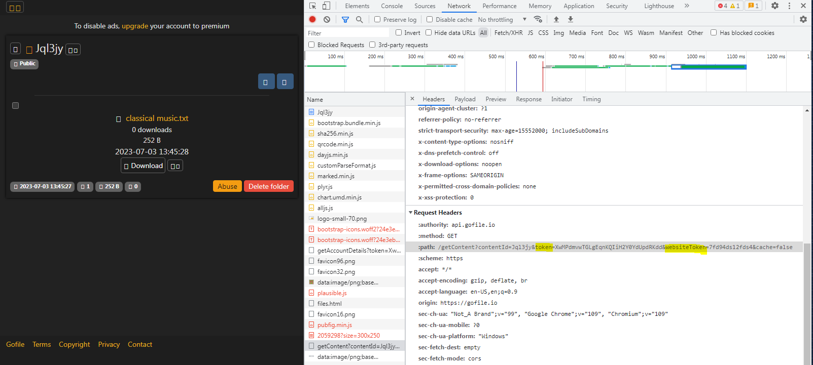

# Gofile Album Scraper

## Dependencies:
* Python 3.5+
* pip install sys
* pip install json
* pip install requests
* pip install ssl

* Tested only for Windows 7+.

---

## gofile.py

A tool to bulk download all media from a Gofile album at once.

### Usage:

An example gofile link: https://gofile.io/d/Jql3jy

```
python gofile.py
->Enter the Gofile album code (ex. "Jql3jy")
->Enter the full download path (ex. "C:\\Users\\volkner39\\Desktop\\gofiles")
->Enter the Token that's given by your browser. (ex. See below for more info)
->Enter the WebToken that's given by your browser. (ex. See below for more info)
->Enter the hashed password that's given by the browser (ex. See below for more info)
```

To find the token, webtoken and hashed password above:
1. Navigate to the Gofile album
2. Enter a password if needed
2. Open dev tools (Network tab)
3. Refresh the page and click the document as shown below
4. Under 'Request Headers', copy the token and webtoken in url.
5. If there's a password involved, copy that value as well.

Below is an image of what you should see:



Disclaimer:
It is illegal to scrape websites without their permission. You can look at the robots.txt file hosted on the website to ensure if this is the case or not. I do not take any responsibility or hold any liability for your actions.