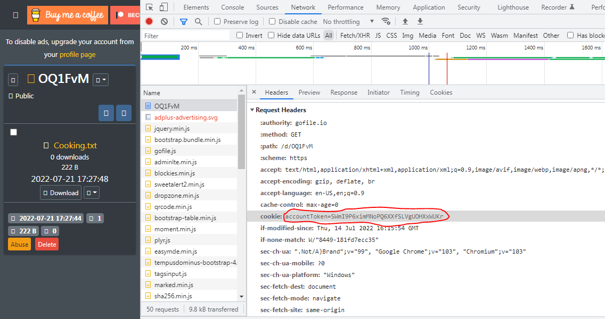

# Gofile Album Scraper

## Dependencies:
* Python 3.5+
* pip install sys
* pip install json
* pip install requests
* pip install ssl

---

## gofile.py

A tool to bulk download all media from a Gofile album at once.

### Usage:

An example gofile link: https://gofile.io/d/OQ1FvM

```
python gofile.py
->Enter the Gofile album code (ex. "OQ1FvM")
->Enter the full download path (ex. "C:\\Users\\volkner39\\Desktop\\GofileAlbum1")
->Enter the Cookie that's given by your browser. (ex. See below for more info)
```

To find the cookie above:
1. Navigate to the Gofile album
2. Open dev tools (Network tab)
3. Refresh the page and click the document row that has the album code
4. Scroll down to 'Request Headers' and copy the cookie.

Below is an image of what you should see:



Disclaimer:
It is illegal to scrape websites without their permission. You can look at the robots.txt file hosted on the website to ensure if this is the case or not. I do not take any responsibility or hold any liability for your actions.